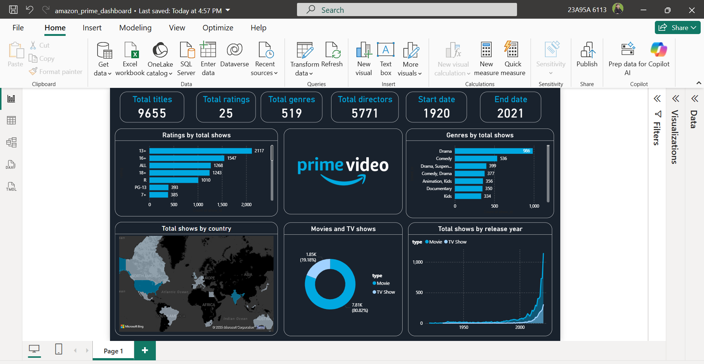

# 📊 Amazon Prime Dashboard

This Power BI project visualizes Amazon Prime content data, including:
- Total titles
- Genre distribution
- Ratings by country and age group
- Content growth over time

## 🖼️ Preview
> View the report in the exported PDF:
👉 [Download Dashboard PDF](amazon_prime_dashboard.pdf)

 <!-- Optional if you added a PNG -->

## 📁 Included Files
- `amazon_prime_dashboard.pbix` – Power BI file
- `amazon_prime_dashboard.pdf` – Exported dashboard
- `dashboard.png` – (Optional) Visual preview

## ❗ Note
Live public sharing is restricted by Power BI tenant settings, so the dashboard is available as PDF and PBIX only.

